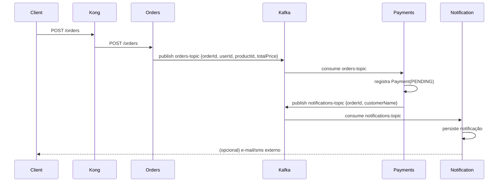
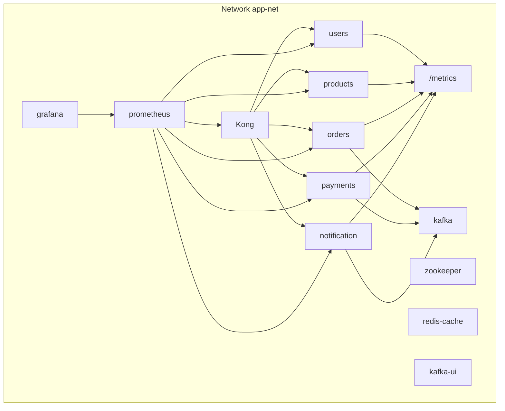

# Arquitetura e Fluxos

## Visão Geral

A plataforma é composta por cinco microsserviços, um gateway de API e um backbone de mensageria. Os serviços persistem dados em Postgres (users, products, payments) e MongoDB (orders). A mensageria usa Kafka para desacoplar criação de pedidos, processamento de pagamentos e emissão de notificações.

## Componentes

- `Kong` como API Gateway para rotear tráfego externo.
- `Kafka` com tópicos:
  - `orders-topic`: eventos de criação de pedidos
  - `notifications-topic`: eventos de notificação de pagamento
- `Prometheus` coleta métricas de todos os serviços e do Kong.
- `Grafana` provê dashboards.

## Fluxo de Pedido e Pagamento

## Métricas e Observabilidade

Todos os serviços expõem `/metrics` com `prom-client`. O plugin Prometheus no Kong expõe métricas do gateway (coletadas pelo Prometheus em `kong:8001/metrics`).

## Persistência

- `users`, `products`, `payments`: Prisma ORM com Postgres.
- `orders`: Mongoose com MongoDB.

## Resiliência

- Consumidores Kafka com reconexões e grupos de consumo dedicados.
- Cache via Redis para aliviar leitura repetitiva.
- Limites e proteção no Kong (rate limiting, request size).

## Topologia (Docker Compose)

## Padrões Adotados

- HTTP JSON simples com Express.
- Prisma para esquemas e migrações nos serviços SQL.
- `prom-client` para instrumentação automática.
- `kafkajs` para produtores/consumidores.

## Decisões

- RabbitMQ removido para consolidar mensageria exclusivamente em Kafka, reduzindo complexidade.
- Kong configurado via arquivo declarativo `kong.yml` para previsibilidade.